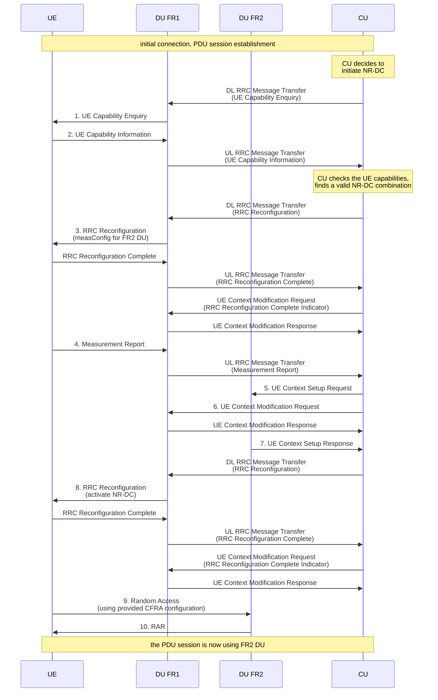

<!-- SPDX-License-Identifier: CC-BY-4.0 -->

# NR-DC tutorial

[[_TOC_]]

This tutorial explains how to test NR-DC with OAI gNB.

## F1 NR-DC

It is possible to test F1-based NR-DC with OAI gNB.

In F1-based NR-DC, the UE is connected to a unique CU (that handles
upper layer protocols, PDCP and above and is connected to the core
network). Its signalling radio bearers are using the FR1 DU for lower
layers (RLC, MAC and PHY). Its data radio bearer (DRB) (in this scenario,
we suppose that the UE requests only one bearer) is also using the FR1
DU for lower layers when it is established but its lower layers (RLC
and below) are immediately transferred to the FR2 DU.

### Setup

The setup is as follows:
- one CU
- one FR1 DU connected to the CU
- one FR2 DU connected to the same CU

Both DUs need to be tightly synchronized. This can be achieved in different
ways depending on the hardware used.

For O-RAN 7.2 RUs, ensure that you use the same PTP clock for both units.

For USRP-based setups (for example, the FR1 DU is using a B210 and the FR2
DU is using an X410 connected to an Interdigital MHU) you need to set the
following in the `RUs` section for both units:

```
         clock_src = "external";
         time_src = "external";
```

And you need to connect both units to the same clock and time sources (PPS
and 10 MHz), for example, a USRP OctoClock.

To set up the CU and the DUs, refer to the documents
[F1AP/F1-design.md](F1AP/F1-design.md) and
[handover-tutorial.md](handover-tutorial.md) that explain how to run one CU
with two different DUs connected to it.

### UEs

NR-DC was successfully tested with the following UEs:

- Samsung S25 (FR1 band n77 40MHz and FR2 band n261 100MHz)
- Quectel RG530 (FR1 band n77 40MHz and FR2 band n261 100MHz)

### Compilation

Refer to the standard ways, depending on your hardware setup.

### Configuration

Add the following in the CU configuration file (at the end,
or anywhere but outside of other blocks).

```
nrdc = {
  combinations = (
    { mcg = 1, scg = 2 },
    { mcg = 3, scg = 4 }
  )
}
```

This will enable two different possible band combinations. The first
combination is for an MCG with nr_cellid==1 and an SCG with nr_cellid==2.
The second combination is for an MCG with nr_cellid==3 and an SCG with
nr_cellid==3.

If you run one DU in band n77 (this DU being the MCG with nr_cellid==1) and
another one in band n261 (this DU being the SCG with nr_cellid==2), then a UE
that supports this NR-DC combination will be put in NR-DC mode. The same
applies if you run one DU in band n78 (with nr_cellid==3) and another one in
band n257 (with nr_cellid==4).

The configuration file uses nr_cellid, not band, to select an MCG/SCG
combination.

### Testing

Once you have your three proper configuration files for the CU and the
two DUs and the system is up and running, connect a UE to the FR1 band.
And if the UE supports the configured band combination, its first PDU
session will be transferred to the FR2 DU.

For example, when testing a Quectel RM530 with bands n77 and n261, run the
following AT command so that it will connect only to band n77 and not
attempt to connect to band n261, which it is otherwise capable of doing.

```
  AT+QNWPREFCFG="nr5g_band",77
```

For the Samsung S25, you need to enable all bands and band combinations.
Refer to this
[external link](https://xdaforums.com/t/how-to-guide-how-to-enable-all-bands-through-service-menu-on-us-ca-s25-series-including-sub-6-and-mmwave.4768929).

### Limitations

Only one data radio bearer and one PDU session are supported at the moment.

Disable IMS if possible.

What actually happens is that only the first PDU session that is established
will be transferred to the FR2 DU.

A multi-PDU session scenario was not tested.

### Traces

Some NR-DC traces may be found in the
[wiki](https://gitlab.eurecom.fr/oai/openairinterface5g/-/wikis/nrdc/nrdc).

### Message flow



1. The UE Capability Enquiry contains the `includeNR-DC` field and a
  `CellGrouping` to specify the MCG and SCG bands
2. The UE Capability Information contains the supported Band Combination List
   that is checked by the CU to activate NR-DC
3. The RRC Reconfiguration contains a measurement configuration for the
   FR2 DU.
4. The Measurement Report contains a measurement of the FR2 DU cell
5. The UE Context Setup Request contains the UE Capabilities and the DRB
   to set up
6. The UE Context Modification Request contains the DRB to remove (the same
   that is to be set up at step 5)
7. The UE Context Setup Response contains the Cell Group Config to be sent
   to the UE. This Cell Group Config contains the RLC bearer to set up
   and all the parameters of the cell, plus the CFRA configuration that
   the UE has to use to connect to the FR2 DU
8. The RRC Reconfiguration contains several elements:
      - `recoverPDCP` for the DRB to transfer from FR1 to FR2
      - removal of the measConfig for the FR2 DU (not necessary for
        completion of NR-DC; added for cleaner processing)
      - removal of RLC bearer from the Master Cell Group (FR1)
      - `mrdc-SecondaryCellGroupConfig` that contains an `RRCReconfiguration`
        with the Cell Group Config sent by the FR2 DU, configuring the
        RLC bearer on the FR2 Cell and all the parameters of the FR2 DU
        cell, plus the CFRA configuration the UE has to use to connect to
        the FR2 DU
9. The Random Access is done according to the configuration sent by the
   FR2 DU
10. After the transmission of the RAR, the connection to the FR2 DU is
    established and data traffic for the DRB is now using the FR2 cell
